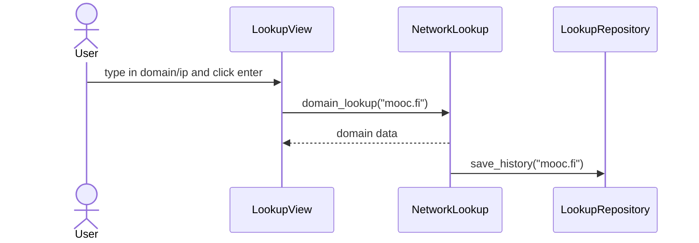

## Pakkauskaavio

Yleiskatsaus sovelluksen kolmitasoisesta kerrosarkkitehtuurista:


## Sovelluslogiikan pääluokka

```
classDiagram
    class NetworkLookup{   
        +domain_lookup(host)
        #domain_ping()
        +find_own_public_ip()
        +find_local_ip()
        +find_mac()
    }
```

## Verkkotunnuksen haku


