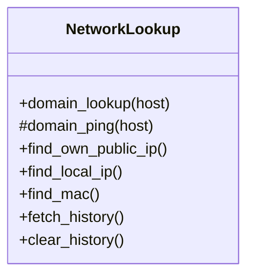
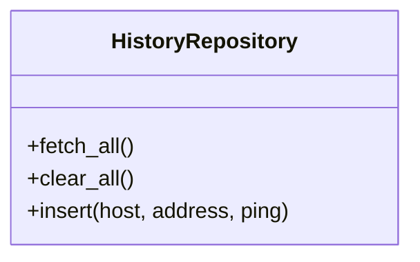
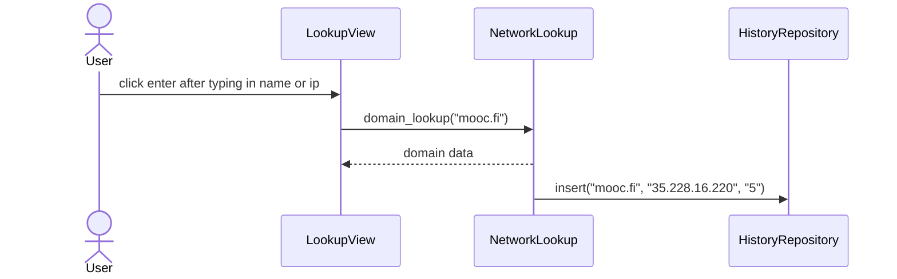
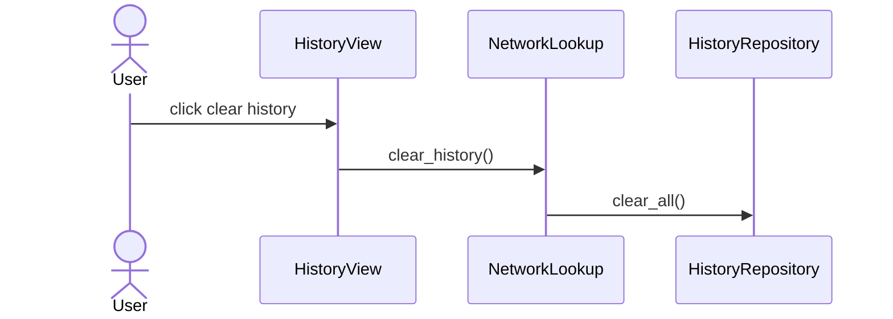

# Arkkitehtuurikuvaus

## Sovelluksen rakenne

Yleiskatsaus sovelluksen kolmitasoisesta kerrosarkkitehtuurista:

UI-pakkauksessa on käyttöliittymän, Services-pakkauksessa sovelluslogiikan ja Repositories-pakkauksessa tietokannan koodi.

### Sovelluslogiikka

Hakutoiminto on eriytetty domain_lookup-funktioon ja sen alifunktioon domain_ping. Nimensä mukaisesti, domain_lookup-funktion vastuulla on domainin saatavuuden ja IP- tai FQDN-osoitteen nouto. Myös tietokantaan tallennus tapahtuu automaattisesti tässä funktiossa. Funktio kutsuu domain_pingiä selvittääkseen latenssin, jos domain osoittautui varatuksi.

Funktioista find-alkuiset hoitavat sovelluksen alkunäkymässä olevien verkkosovitinosoitteiden noudon.

Hakuhistoria voidaan noutaa taulukkoon ja poistaa tietokannasta history-metodien avulla, joilla kutsutaan history_repositorystä injektoituja toimintoja.

### Tietokantatoiminnot

Pysyväistallennus on HistoryRepository-luokan vastuulla. Sovelluslogiikan NetworkLookup-luokka kutsuu HistoryRepository-luokan insert-metodia aina kun käyttäjä on hakenut varatun domainin. Näin se saadaan tallennetuksi initialize_database-tiedostossa alustettuun history-tietokantaan.

Historia voidaan poistaa käyttöliittymän napilla, joka kutsuu NetworkLookup-luokkaa, joka edelleen kutsuu HistoryRepository-luokan clear_all-metodia.

## Sovelluksen toimintalogiikka

### Domainhaku ja historian tallennus

### Historian poisto

